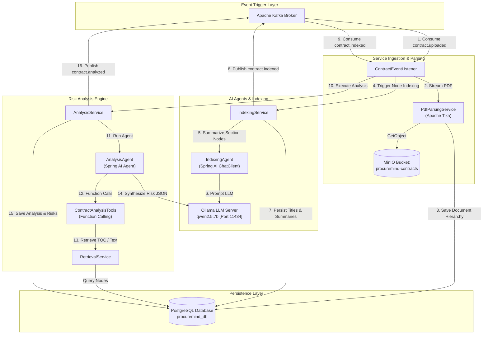

# ProcureMind — AI Service (`ai-service`)

The **AI Service** is the intelligence engine of the **ProcureMind** microservices ecosystem. Operating on port `8082`, it leverages **Spring AI 1.1.0**, **Apache Tika 3.2.2**, **MinIO**, **PostgreSQL**, and local LLM inference via **Ollama (Qwen2.5 7B)** to transform unstructured contract PDFs into hierarchical index trees, structured metadata, and multi-factor risk assessments.

---

## Architectural & Bounded Context Role

`ai-service` encapsulates all artificial intelligence, natural language document processing, agentic tool execution, and analytical query handling.



---

## Key Features

1. **Apache Tika Document Parsing**: Streams PDFs directly from MinIO and extracts raw text buffers.
2. **Hierarchical Document Indexing**: Parses regex section boundaries (`Article...`, `1.1...`) into a multi-tiered entity tree (`ROOT` ➔ `ARTICLE` ➔ `SECTION`).
3. **Structured Indexing Agent (`IndexingAgent`)**: Uses Spring AI `ChatClient` with structured JSON output binding (`NodeSummary`) to generate concise section titles and executive summaries without hallucinations.
4. **Tool-Calling Risk Analysis Agent (`AnalysisAgent`)**: Employs Spring AI Function Calling with `ContractAnalysisTools` (`getContractSummary`, `getClauseContent`, `getVendorHistory`) to inspect document Table of Contents prior to pulling targeted text, reducing token overhead.
5. **CQRS Analytics Read Model**: Serves metrics, risk severities, clause content, and contract comparison endpoints to `procuremind-ui`.

---

## Package Structure & Key Classes

```
ai-service/
├── pom.xml
├── README.md
└── src/
    └── main/
        ├── java/com/procuremind/ai_service/
        │   ├── AiServiceApplication.java
        │   ├── agent/
        │   │   ├── AnalysisAgent.java
        │   │   ├── IndexingAgent.java
        │   │   └── tools/
        │   │       └── ContractAnalysisTools.java
        │   ├── config/
        │   │   └── MinioConfig.java
        │   ├── controller/
        │   │   └── AnalysisController.java
        │   ├── dto/
        │   │   ├── AnalysisResponseDto.java
        │   │   ├── ClauseContentDto.java
        │   │   ├── ContractAnalysisResultDto.java
        │   │   ├── DashboardMetricsDto.java
        │   │   ├── NodeSummary.java
        │   │   └── TocNodeDto.java
        │   ├── entity/
        │   │   ├── AnalysisRisk.java
        │   │   ├── ContractAnalysis.java
        │   │   ├── ContractMetadata.java
        │   │   ├── NodeType.java
        │   │   └── PageIndexNode.java
        │   ├── Repository/
        │   │   ├── AnalysisRiskRepository.java
        │   │   ├── ContractAnalysisRepository.java
        │   │   ├── ContractMetadataRepository.java
        │   │   └── PageIndexNodeRepository.java
        │   └── service/
        │       ├── AnalysisQueryService.java
        │       ├── AnalysisService.java
        │       ├── IndexingService.java
        │       ├── PdfParsingService.java
        │       ├── RetrievalService.java
        │       └── kafka/
        │           ├── ContractEventListener.java
        │           └── ContractEventProducer.java
        └── resources/
            └── application.yaml
```

---

## Agentic AI Execution Workflow

### 1. Indexing Agent (`IndexingAgent.java`)
Prompts Ollama Qwen2.5 with a dedicated system role:

> *"You are an expert legal document indexing assistant. Extract title (3-5 words) and summary (1-2 sentences)..."*

Iterates over unindexed `PageIndexNode` records and maps response directly into Java Record `NodeSummary(String title, String summary)`.

### 2. Analysis Agent (`AnalysisAgent.java`)
Prompts Ollama Qwen2.5 as a Senior Enterprise Procurement Officer configured with tools:

1. Calls `getContractSummary(documentId)` to inspect titles and node UUIDs.
2. Calls `getClauseContent(nodeId)` for high-risk clauses (e.g., Liability, Indemnification).
3. Calls `getVendorHistory(vendorName)` for past compliance records.
4. Synthesizes findings into `ContractAnalysisResultDto`.

---

## Database Schemas (`procuremind_db`)

```sql
-- Document Index Nodes
CREATE TABLE page_index_nodes (
    id UUID PRIMARY KEY,
    document_id UUID NOT NULL,
    parent_node_id UUID,
    level INT NOT NULL,
    node_order INT NOT NULL,
    node_type VARCHAR(50) NOT NULL, -- ROOT, ARTICLE, SECTION
    title VARCHAR(255),
    summary TEXT,
    raw_context TEXT NOT NULL
);

-- Contract Analysis Results
CREATE TABLE contract_analyses (
    id UUID PRIMARY KEY,
    contract_id UUID NOT NULL,
    risk_score DOUBLE PRECISION NOT NULL,
    recommendation TEXT,
    status VARCHAR(50) NOT NULL,
    created_at TIMESTAMP NOT NULL
);

-- Contract Metadata
CREATE TABLE contract_metadata (
    id UUID PRIMARY KEY,
    contract_id UUID NOT NULL,
    contract_type VARCHAR(255),
    amount DOUBLE PRECISION
);

-- Individual Clause Risks
CREATE TABLE analysis_risks (
    id UUID PRIMARY KEY,
    analysis_id UUID NOT NULL REFERENCES contract_analyses(id),
    severity VARCHAR(50) NOT NULL, -- HIGH, MEDIUM, LOW
    description TEXT NOT NULL
);
```

---

## REST API Specification

### Base Path: `/api/analysis`

| Method | Endpoint | Description | Payload / Query |
| :--- | :--- | :--- | :--- |
| `GET` | `/api/analysis/{contractId}` | Fetch risk score, recommendation, and metadata for a contract. | Path variable `contractId` (UUID) |
| `GET` | `/api/analysis/{contractId}/risks` | Fetch list of identified risks for a specific contract. | Path variable `contractId` (UUID) |
| `GET` | `/api/analysis/{contractId}/toc` | Retrieve hierarchical Table of Contents index nodes. | Path variable `contractId` (UUID) |
| `GET` | `/api/analysis/node/{nodeId}` | Retrieve raw clause text and metadata for a specific section node. | Path variable `nodeId` (UUID) |
| `GET` | `/api/analysis/dashboard-metrics` | Retrieve global aggregated metrics (total analyzed, average risk). | None |
| `GET` | `/api/analysis/risks/top` | Retrieve top high-risk clauses across all analyzed contracts. | None |
| `GET` | `/api/analysis/compare` | Compare risk scores and extracted terms across multiple contracts. | `?ids=uuid1,uuid2` |

---

## Configuration Properties (`application.yaml`)

```yaml
server:
  port: 8082

spring:
  datasource:
    url: jdbc:postgresql://localhost:5433/procuremind_db
    username: user
    password: password
  kafka:
    bootstrap-servers: localhost:9092
    consumer:
      group-id: ai-processing-group
  ai:
    ollama:
      base-url: http://localhost:11434
      chat:
        options:
          model: qwen2.5:7b
          temperature: 0.1
```

---

## Local Development & Setup

### Prerequisites
1. Ensure Ollama container is active (`http://localhost:11434`).
2. Verify `qwen2.5:7b` model is downloaded (`docker exec -it procuremind-ollama ollama pull qwen2.5:7b`).

### Build & Run
```bash
# Build package
./mvnw clean package -DskipTests

# Start service
./mvnw spring-boot:run
```
