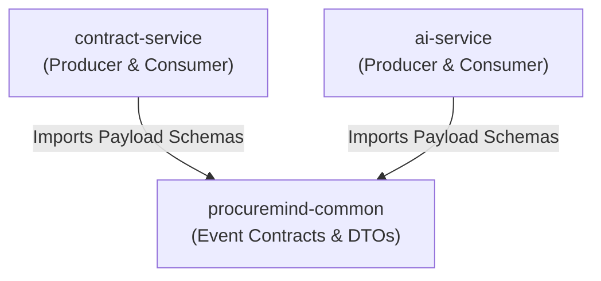

# ProcureMind — Common Shared Library (`procuremind-common`)

**ProcureMind Common** is the foundational shared Maven library containing cross-service Data Transfer Objects (DTOs) and event contract definitions for the ProcureMind microservices platform.

---

## Purpose & Architectural Role

In an asynchronous event-driven architecture, microservices must share immutable event contracts without introducing tight compile-time coupling between domain services. `procuremind-common` fulfills this role by establishing a centralized schema repository for Apache Kafka event payloads.

Both `contract-service` and `ai-service` import `procuremind-common` as a Maven dependency:



---

## Event Contracts & Data Transfer Objects

All event contracts are modeled as immutable Java **Records** for thread safety, concise syntax, and seamless JSON serialization via Jackson and Spring Kafka.

### 1. `ContractUploadedEvent`
* **Package**: `com.procuremind.common.dto`
* **File**: `ContractUploadedEvent.java`
* **Produced By**: `contract-service` (in `ContractEventProducer`)
* **Consumed By**: `ai-service` (in `ContractEventListener`)
* **Kafka Topic**: `contract.uploaded`
* **Purpose**: Emitted immediately after a contract file is successfully uploaded to MinIO object storage and saved in PostgreSQL.

```java
package com.procuremind.common.dto;

import java.util.UUID;

public record ContractUploadedEvent(
        UUID contractId,
        String filename,
        String minioObjName
) {}
```

#### Field Description
* `contractId`: Unique UUID generated for the uploaded contract entity.
* `filename`: Original filename of the uploaded PDF file.
* `minioObjName`: Key/object identifier assigned to the file inside the MinIO bucket `procuremind-contracts`.

---

### 2. `PageIndexedEvent`
* **Package**: `com.procuremind.common.dto`
* **File**: `PageIndexedEvent.java`
* **Produced By**: `ai-service` (in `ContractEventProducer`)
* **Consumed By**: `contract-service` & `ai-service` (in `ContractEventListener`)
* **Kafka Topics**: `contract.indexed`, `contract.analyzed`
* **Purpose**: Emitted by `ai-service` upon completing document section indexing or contract AI analysis to propagate state transitions.

```java
package com.procuremind.common.dto;

import java.util.UUID;

public record PageIndexedEvent(
        UUID contractId,
        String status
) {}
```

#### Field Description
* `contractId`: Unique UUID of the contract document undergoing processing.
* `status`: Processing state marker (`INDEXED` or `ANALYSIS_COMPLETED`).

---

## Module Boundaries & Best Practices

To maintain loose coupling and prevent architectural erosion, `procuremind-common` follows strict boundary rules:

### Allowed Content
✓ Immutable Java records and DTO contracts.  
✓ Shared system constants and event topic name contracts.  
✓ Custom exception types shared across domain boundaries (if applicable).  

### Prohibited Content (Anti-Patterns)
❌ **Zero Business Logic**: No `@Service`, `@Component`, or business calculations.  
❌ **Zero Database Dependencies**: No JPA entities, `@Table` annotations, or ORM mappings.  
❌ **Zero Infrastructure Beans**: No Kafka listener definitions, Web MVC controllers, or Spring Security configurations.  

---

## Integration Guide

To consume `procuremind-common` in downstream microservices:

### 1. Add Maven Dependency

```xml
<dependency>
    <groupId>com.procuremind</groupId>
    <artifactId>procuremind-common</artifactId>
    <version>1.0-SNAPSHOT</version>
</dependency>
```

### 2. Configure Kafka Trusted Packages

Ensure downstream Spring Boot `application.yaml` files trust the `com.procuremind.*` package namespace for Kafka `JsonDeserializer`:

```yaml
spring:
  kafka:
    properties:
      spring.json.trusted.packages: "com.procuremind.*"
```

### 3. Local Installation to Maven Repository

```bash
cd procuremind-common
./mvnw clean install
```
