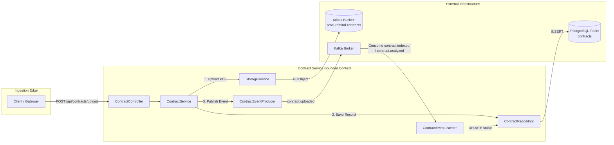
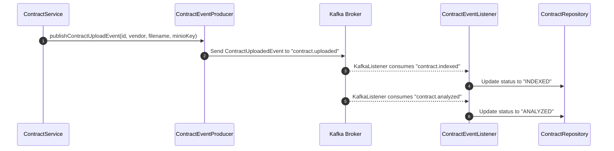

# ProcureMind — Contract Service (`contract-service`)

The **Contract Service** owns the **Contract Ingestion and Lifecycle Bounded Context** in the **ProcureMind** microservices ecosystem. Operating on port `8081`, it handles HTTP multipart contract PDF uploads, stores physical files in **MinIO Object Storage**, persists metadata in **PostgreSQL**, emits domain lifecycle events to **Apache Kafka**, and updates contract state asynchronously based on AI processing feedback.

---

## Service Overview & Bounded Context

`contract-service` is responsible for contract metadata management and physical object storage. It isolates file ingestion concerns from downstream AI analysis compute heavy lifting.



---

## Features

* **Multipart File Ingestion**: Supports uploading contract PDF documents up to 70MB.
* **MinIO Object Storage Integration**: Programmatically verifies/creates buckets (`procuremind-contracts`) and streams uploaded files with unique UUID identifiers.
* **Contract State Machine**: Manages contract lifecycle states: `UPLOADED` ➔ `INDEXED` ➔ `ANALYZED`.
* **Asynchronous Event Publishing**: Emits `ContractUploadedEvent` payloads to Kafka topic `contract.uploaded`.
* **State Propagation Listener**: Consumes `PageIndexedEvent` messages from `contract.indexed` and `contract.analyzed` topics to keep status in sync with `ai-service`.
* **OpenAPI 3.0 / Swagger UI**: Built-in interactive API documentation at `/swagger-ui.html`.

---

## Package Breakdown & Core Classes

```
contract-service/
├── pom.xml
├── README.md
└── src/
    └── main/
        ├── java/com/procuremind/contract_service/
        │   ├── ContractServiceApplication.java
        │   ├── config/
        │   │   └── MinioConfig.java
        │   ├── controller/
        │   │   └── ContractController.java
        │   ├── dto/
        │   │   └── ContractResponseDto.java
        │   ├── entity/
        │   │   └── Contract.java
        │   ├── repository/
        │   │   └── ContractRepository.java
        │   ├── service/
        │   │   ├── ContractService.java
        │   │   ├── StorageService.java
        │   │   └── kafka/
        │   │       ├── ContractEventListener.java
        │   │       └── ContractEventProducer.java
        └── resources/
            ├── application.yaml
            └── db/migration/
```

### Core Architecture Components

#### 1. Controller Layer
* **[ContractController.java](file:///r:/Projects/ProcureMind/contract-service/src/main/java/com/procuremind/contract_service/controller/ContractController.java)**: Exposes REST endpoints under `/api/contracts`.

#### 2. Service Layer
* **[ContractService.java](file:///r:/Projects/ProcureMind/contract-service/src/main/java/com/procuremind/contract_service/service/ContractService.java)**: Coordinates contract upload, MinIO storage delegation, database persistence, and event emission within `@Transactional` boundaries.
* **[StorageService.java](file:///r:/Projects/ProcureMind/contract-service/src/main/java/com/procuremind/contract_service/service/StorageService.java)**: Interacts with MinIO SDK to auto-provision the `procuremind-contracts` bucket and upload binary data streams.

#### 3. Kafka Messaging Layer
* **[ContractEventProducer.java](file:///r:/Projects/ProcureMind/contract-service/src/main/java/com/procuremind/contract_service/service/kafka/ContractEventProducer.java)**: Constructs and sends `ContractUploadedEvent` payloads to Kafka topic `contract.uploaded`.
* **[ContractEventListener.java](file:///r:/Projects/ProcureMind/contract-service/src/main/java/com/procuremind/contract_service/service/kafka/ContractEventListener.java)**: Listens on Kafka topics `contract.indexed` and `contract.analyzed` with group ID `contract-processing-group` to update contract entity status.

#### 4. Repository & Data Layer
* **[ContractRepository.java](file:///r:/Projects/ProcureMind/contract-service/src/main/java/com/procuremind/contract_service/repository/ContractRepository.java)**: Spring Data JPA interface for `Contract` entity manipulation.
* **[Contract.java](file:///r:/Projects/ProcureMind/contract-service/src/main/java/com/procuremind/contract_service/entity/Contract.java)**: JPA Entity mapped to table `contracts`.

#### 5. Configuration & DTOs
* **[MinioConfig.java](file:///r:/Projects/ProcureMind/contract-service/src/main/java/com/procuremind/contract_service/config/MinioConfig.java)**: Spring `@Configuration` bean instantiating `MinioClient` (`http://localhost:9000`).
* **[ContractResponseDto.java](file:///r:/Projects/ProcureMind/contract-service/src/main/java/com/procuremind/contract_service/dto/ContractResponseDto.java)**: External DTO representing contract details.

---

## Database Entity & Schema

Target Database: PostgreSQL (`procuremind_db`)  
Table Name: `contracts`

```sql
CREATE TABLE contracts (
    id UUID PRIMARY KEY,
    filename VARCHAR(255) NOT NULL,
    minio_object_name VARCHAR(255) NOT NULL,
    vendor_name VARCHAR(255),
    status VARCHAR(50) NOT NULL,
    uploaded_at TIMESTAMP NOT NULL
);
```

---

## Kafka Event Integration Topology



### Events Table

| Event Payload Class | Direction | Kafka Topic | Trigger / Action |
| :--- | :--- | :--- | :--- |
| `ContractUploadedEvent` | Outgoing (Produced) | `contract.uploaded` | Triggered on new file upload. |
| `PageIndexedEvent` | Incoming (Consumed) | `contract.indexed` | Updates status to `INDEXED`. |
| `PageIndexedEvent` | Incoming (Consumed) | `contract.analyzed` | Updates status to `ANALYZED`. |

---

## REST API Specification

### Base Path: `/api/contracts`

#### 1. Upload Contract Document
* **Method**: `POST`
* **Path**: `/api/contracts/upload`
* **Content-Type**: `multipart/form-data`
* **Request Parameters**:
  * `file` (MultipartFile, required): PDF document file.
  * `vendorName` (String, optional, default: `"Unknown Vendor"`): Name of the vendor.
* **Response Status**: `202 Accepted`
* **Response Body** (`ContractResponseDto`):
```json
{
  "id": "c0a80123-8c76-4d2b-9e12-3a4b5c6d7e8f",
  "fileName": "Master_Services_Agreement.pdf",
  "vendorName": "Acme Corp",
  "status": "UPLOADED",
  "uploadedAt": "2026-08-04T18:30:00"
}
```

#### 2. Get All Contracts
* **Method**: `GET`
* **Path**: `/api/contracts`
* **Response Status**: `200 OK`
* **Response Body**: Array of `ContractResponseDto`.

#### 3. Get Contract Details by ID
* **Method**: `GET`
* **Path**: `/api/contracts/{id}`
* **Response Status**: `200 OK` / `404 Not Found`

#### 4. Get Contract Status by ID
* **Method**: `GET`
* **Path**: `/api/contracts/{id}/status`
* **Response Status**: `200 OK`
* **Response Body**:
```json
{
  "status": "ANALYZED"
}
```

---

## Configuration & Environment Variables

Key properties in `application.yaml`:

```yaml
server:
  port: 8081

spring:
  servlet:
    multipart:
      max-file-size: 70MB
      max-request-size: 70MB
  datasource:
    url: jdbc:postgresql://localhost:5433/procuremind_db
    username: user
    password: password
  kafka:
    bootstrap-servers: localhost:9092
    consumer:
      group-id: contract-processing-group
```

---

## Development & Testing

### Building Service
```bash
./mvnw clean package -DskipTests
```

### Running Locally
```bash
./mvnw spring-boot:run
```

### OpenAPI / Swagger UI
Navigate to `http://localhost:8081/swagger-ui.html` when running locally.
