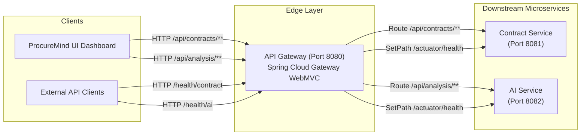

# ProcureMind — API Gateway Service (`api-gateway`)

The **API Gateway** is the single entry-point reverse proxy for the **ProcureMind** microservices ecosystem. Powered by **Spring Boot 4.0.7** and **Spring Cloud Gateway WebMVC** on **Java 21**, it centralizes incoming client HTTP request routing, path rewriting, and downstream service health probes.

---

## Architectural Role

In the ProcureMind microservices topology, the API Gateway resides at the edge layer, exposing port `8080`. It decouples client applications (such as `procuremind-ui`) from downstream internal service network topologies, allowing services to scale or relocate without impacting API consumers.



---

## Service Responsibilities & Boundaries

### Responsibilities
* **Unified Request Routing**: Routes contract lifecycle operations (`/api/contracts/**`) to `contract-service` and AI document analytics requests (`/api/analysis/**`) to `ai-service`.
* **Health Probe Proxying**: Aggregates downstream Actuator endpoints via clean public health path aliases (`/health/contract` and `/health/ai`).
* **Environment-Driven Endpoint Resolution**: Supports dynamic target URI configuration via system environment variables (`CONTRACT_SERVICE_URL`, `AI_SERVICE_URL`).
* **Centralized Observability**: Exposes gateway-level Spring Boot Actuator endpoints for system health and build information.

### Module Boundaries & Anti-Patterns
* **No Business Logic**: Must never perform database lookups, business validations, or event processing.
* **No File Parsing**: Must pass multipart form data streams directly to `contract-service` without inspecting or caching byte buffers.
* **No Token Manipulation**: Operates as a thin proxy router; authentication and payload transformation remain isolated within respective domain services.

---

## Package Breakdown & Core Classes

```
api-gateway/
├── pom.xml
├── README.md
└── src/
    └── main/
        ├── java/
        │   └── com/procuremind/api_gateway/
        │       └── ApiGatewayApplication.java
        └── resources/
            └── application.yaml
```

### Core Classes & Files
* **[ApiGatewayApplication.java](file:///r:/Projects/ProcureMind/api-gateway/src/main/java/com/procuremind/api_gateway/ApiGatewayApplication.java)**: Spring Boot application entry point marked with `@SpringBootApplication`.
* **[application.yaml](file:///r:/Projects/ProcureMind/api-gateway/src/main/resources/application.yaml)**: Declarative gateway routing configuration, predicate rules, path rewriting filters, and logging levels.

---

## Gateway Route Configuration

The API Gateway routes traffic based on declarative predicates defined in `application.yaml`:

```yaml
spring:
  cloud:
    gateway:
      server:
        webmvc:
          routes:
            - id: contract-service-route
              uri: ${CONTRACT_SERVICE_URL:http://localhost:8081}
              predicates:
                - Path=/api/contracts, /api/contracts/**

            - id: ai-service-route
              uri: ${AI_SERVICE_URL:http://localhost:8082}
              predicates:
                - Path=/api/analysis, /api/analysis/**

            - id: contract-service-health
              uri: ${CONTRACT_SERVICE_URL:http://localhost:8081}
              predicates:
                - Path=/health/contract
              filters:
                - SetPath=/actuator/health

            - id: ai-service-health
              uri: ${AI_SERVICE_URL:http://localhost:8082}
              predicates:
                - Path=/health/ai
              filters:
                - SetPath=/actuator/health
```

### Routing Summary Table

| Route ID | Inbound Path Predicate | Filter Action | Target Downstream Service | Default Fallback URL |
| :--- | :--- | :--- | :--- | :--- |
| `contract-service-route` | `/api/contracts`, `/api/contracts/**` | None (Direct proxy) | Contract Service | `http://localhost:8081` |
| `ai-service-route` | `/api/analysis`, `/api/analysis/**` | None (Direct proxy) | AI Service | `http://localhost:8082` |
| `contract-service-health` | `/health/contract` | `SetPath=/actuator/health` | Contract Service Actuator | `http://localhost:8081/actuator/health` |
| `ai-service-health` | `/health/ai` | `SetPath=/actuator/health` | AI Service Actuator | `http://localhost:8082/actuator/health` |

---

## Environment Variables

| Variable Name | Default Value | Description |
| :--- | :--- | :--- |
| `SERVER_PORT` | `8080` | HTTP port on which the API Gateway listens. |
| `CONTRACT_SERVICE_URL` | `http://localhost:8081` | Base URL for downstream `contract-service` instances. |
| `AI_SERVICE_URL` | `http://localhost:8082` | Base URL for downstream `ai-service` instances. |

---

## Development & Execution

### Building the Gateway
```bash
./mvnw clean package -DskipTests
```

### Running Locally
```bash
./mvnw spring-boot:run
```

### Running with Custom Service Locations
```bash
CONTRACT_SERVICE_URL=http://10.0.1.5:8081 AI_SERVICE_URL=http://10.0.1.6:8082 ./mvnw spring-boot:run
```

---

## Observability & Diagnostics

The gateway exposes full health probes and detailed debug logging:

* **Gateway Health**: `GET http://localhost:8080/actuator/health`
* **Proxied Contract Service Health**: `GET http://localhost:8080/health/contract`
* **Proxied AI Service Health**: `GET http://localhost:8080/health/ai`

Debug logging is configured for Spring Cloud Gateway and Web MVC in `application.yaml`:
```yaml
logging:
  level:
    org.springframework.cloud.gateway: DEBUG
    org.springframework.web: DEBUG
```
