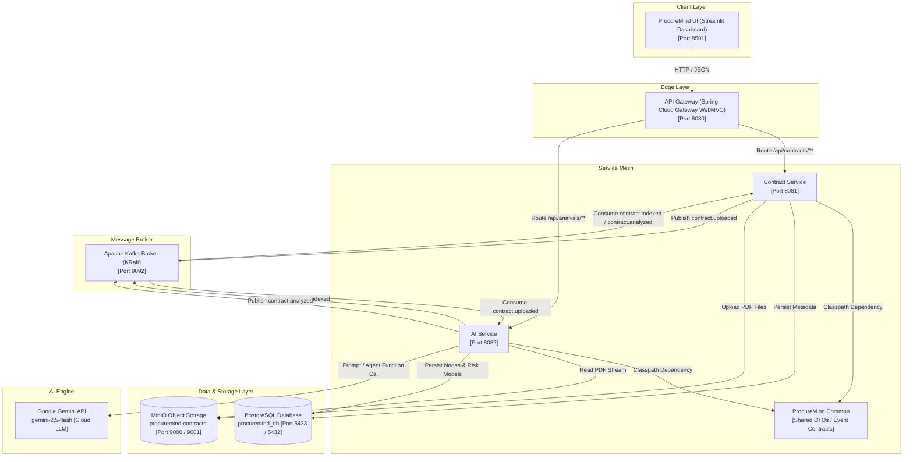
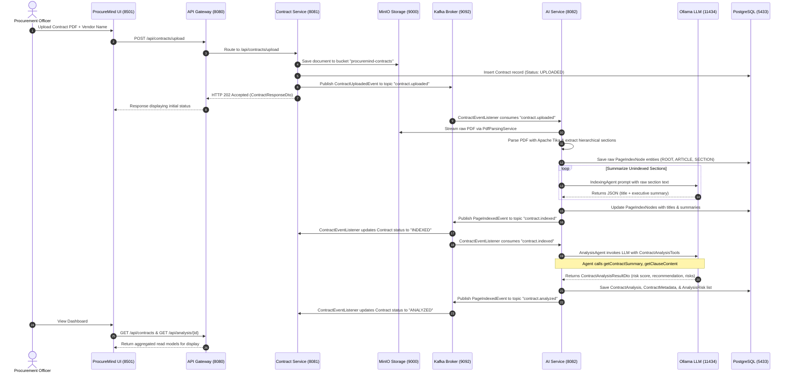

# ProcureMind — AI-Native Procurement Contract Analysis Platform

**ProcureMind** is an enterprise-grade, event-driven microservices platform engineered to automate legal contract ingestion, hierarchical document indexing, vendor compliance tracking, and AI-powered risk scoring. Built on **Spring Boot 4.0.7**, **Spring AI 1.1.0**, **Spring Cloud Gateway WebMVC**, **Apache Kafka**, **MinIO Object Storage**, **PostgreSQL**, and **Google Gemini API (Gemini 2.5 Flash)**, ProcureMind turns raw procurement PDFs into structured, actionable intelligence.

---

## Architecture Overview

ProcureMind leverages a decoupled, asynchronous, event-driven architecture designed for high throughput, fault isolation, and reproducible AI inference.



> 📖 **Deep Dive Documentation**: For exhaustive architectural specifications, sequence diagrams, database entity-relationship models, and agent workflows, see [System Architecture Specification](docs/architecture.md).

---

## End-to-End Execution Sequence



---

## Module Breakdown

| Module | Technologies | Description |
| :--- | :--- | :--- |
| **[api-gateway](api-gateway/README.md)** | Java 21, Spring Boot 4.0.7, Spring Cloud Gateway WebMVC | Single entry-point reverse proxy routing inbound HTTP requests to downstream microservices and proxying Actuator health checks. |
| **[procuremind-common](procuremind-common/README.md)** | Java 21 | Shared record-based DTOs and Kafka event contracts (`ContractUploadedEvent`, `PageIndexedEvent`). |
| **[contract-service](contract-service/README.md)** | Java 21, Spring Boot 4.0.7, JPA, MinIO SDK, Kafka | Bounded context owning contract upload, file persistence to MinIO, contract metadata status lifecycle, and state propagation. |
| **[ai-service](ai-service/README.md)** | Java 21, Spring Boot 4.0.7, Spring AI, Apache Tika, Google Gemini | Bounded context for PDF parsing, hierarchical section indexing (`IndexingAgent`), LLM tool-calling analysis (`AnalysisAgent`), conversational assistant (`ChatAgent`), risk scoring, and analytical queries. |
| **[procuremind-ui](procuremind-ui/README.md)** | Python 3.13, Streamlit, Pandas, Plotly | Front-end web dashboard aggregating CQRS read models across `contract-service` and `ai-service` via `api-gateway`. |
| **[DummyContracts](DummyContracts/README.md)** | PDF Agreements, JSON Datasets | Sample legal contracts and exported database test fixtures for seeding and offline verification. |

---

## Infrastructure Stack (Docker Compose)

ProcureMind relies on dockerized infrastructure managed via `docker-compose.yaml`:

```yaml
services:
  postgres:      # PostgreSQL 15 Database (Port 5433 Host -> 5432 Container)
  minio:         # MinIO Object Storage (Ports 9000 API / 9001 Web Console)
  kafka:         # Confluent Kafka 7.4.4 KRaft Broker (Port 9092)
  kafka-ui:      # Kafka Management Dashboard (Port 8085 Host -> 8080 Container)
```

---

## Database Architecture

ProcureMind uses PostgreSQL (`procuremind_db`) hosting tables across two bounded contexts:

### 1. Contract Bounded Context (`contract-service`)
* `contracts`: Primary record tracking contract UUID, filename, vendor name, status (`UPLOADED`, `INDEXED`, `ANALYZED`), MinIO object key, and upload timestamp.

### 2. AI & Analysis Bounded Context (`ai-service`)
* `page_index_nodes`: Hierarchical document structure (`ROOT`, `ARTICLE`, `SECTION`) storing raw section text, AI generated titles, summaries, and node ordering.
* `contract_metadata`: Key metadata extracted during AI analysis (contract type, total dollar amount).
* `contract_analysis`: Overall risk assessment score (1.0 to 10.0), recommendation, processing status, and timestamp.
* `analysis_risks`: Granular risk entries associated with a contract analysis (severity: `HIGH`, `MEDIUM`, `LOW`, description).

---

## Asynchronous Event Topology

Communication across microservices is non-blocking and mediated by Kafka topics:

| Kafka Topic | Producer Service | Consumer Service(s) | Payload DTO | Purpose |
| :--- | :--- | :--- | :--- | :--- |
| `contract.uploaded` | `contract-service` | `ai-service` | `ContractUploadedEvent` | Triggers PDF parsing and section indexing upon contract upload. |
| `contract.indexed` | `ai-service` | `contract-service`, `ai-service` | `PageIndexedEvent` | Updates contract status to `INDEXED` and triggers `AnalysisAgent` execution. |
| `contract.analyzed` | `ai-service` | `contract-service` | `PageIndexedEvent` | Updates contract status to `ANALYZED` upon risk scoring completion. |

---

## Developer Quickstart

### Prerequisites
* **Java 21 JDK**
* **Maven 3.9+** (or included `mvnw` wrappers)
* **Python 3.13+** (with `uv` or `pip`)
* **Docker Desktop**
* **Google Gemini API Key** (from [Google AI Studio](https://aistudio.google.com/))

### Option A: Run Complete Stack with Docker Compose (Recommended)

From the project root:

```bash
# 1. Configure your Gemini API key
cp .env.example .env
# Edit .env and set GEMINI_API_KEY=your_key_here

# 2. Build and launch all infrastructure, microservices, and UI containers
docker compose up --build -d
```

Once started:
* **Streamlit Executive UI**: `http://localhost:8501`
* **API Gateway**: `http://localhost:8080`
* **Kafka UI Dashboard**: `http://localhost:8085`
* **MinIO Storage Console**: `http://localhost:9001` (User: `admin` / Password: `password`)

To view logs across all services:
```bash
docker compose logs -f
```

To shut down the platform:
```bash
docker compose down
```

---

### Option B: Local Development (Hybrid)

If developing microservices locally with IDEs while running infrastructure in Docker:

#### Step 1: Start Infrastructure Containers Only

```bash
docker compose up postgres minio kafka ollama kafka-ui -d
docker exec -it procuremind-ollama ollama pull qwen2.5:7b
```

#### Step 2: Build Monorepo Dependencies

```bash
# Build procuremind-common shared library
cd procuremind-common
./mvnw clean install -DskipTests
cd ..

# Build parent modules
./mvnw clean compile -DskipTests
```

#### Step 3: Run Microservices Locally

Launch services in separate terminal windows:

```bash
# Terminal 1: Contract Service
cd contract-service
./mvnw spring-boot:run

# Terminal 2: AI Service
cd ai-service
./mvnw spring-boot:run

# Terminal 3: API Gateway
cd api-gateway
./mvnw spring-boot:run

# Terminal 4: Streamlit UI
cd procuremind-ui
uv sync && uv run streamlit run main.py
# Or with standard pip: streamlit run main.py
```

---

## Observability & Health Probes

All Spring Boot microservices expose Spring Boot Actuator endpoints routed through API Gateway:

* **API Gateway Health**: `http://localhost:8080/actuator/health`
* **Contract Service Health via Gateway**: `http://localhost:8080/health/contract`
* **AI Service Health via Gateway**: `http://localhost:8080/health/ai`
* **Contract Service OpenAPI Docs**: `http://localhost:8081/swagger-ui.html`
* **AI Service OpenAPI Docs**: `http://localhost:8082/swagger-ui.html`

---

## Repository Structure

```
ProcureMind/
├── docker-compose.yaml           # Infrastructure setup (Postgres, MinIO, Kafka, Ollama, Kafka-UI)
├── pom.xml                       # Parent Maven POM
├── README.md                     # Root Architecture & System Documentation
├── docs/                         # Consolidated Architecture & Diagrams
│   ├── architecture.md           # System Architecture Deep Dive
│   └── images/                   # System diagrams and screenshots
├── DummyContracts/               # Sample PDF agreements and test datasets
│   └── README.md
├── api-gateway/                  # Spring Cloud Gateway WebMVC service
│   ├── pom.xml
│   ├── README.md
│   └── src/
├── procuremind-common/           # Shared Event DTOs and Contracts library
│   ├── pom.xml
│   ├── README.md
│   └── src/
├── contract-service/             # Contract ingestion & MinIO storage service
│   ├── pom.xml
│   ├── README.md
│   └── src/
├── ai-service/                   # Spring AI parsing, indexing, and analysis service
│   ├── pom.xml
│   ├── README.md
│   └── src/
└── procuremind-ui/               # Streamlit web dashboard
    ├── pyproject.toml
    ├── README.md
    └── src/
```

---

## Enterprise Best Practices & Design Principles

1. **Domain Isolation**: `contract-service` does not contain AI code or LLM dependencies. `ai-service` does not handle raw HTTP file upload endpoints.
2. **Zero Ingest Lock-In**: Direct PDF streaming from MinIO ensures large PDF files are processed asynchronously without blocking HTTP client connections.
3. **Structured Agentic Tools**: The `AnalysisAgent` uses Spring AI Function Calling (`ContractAnalysisTools`) to inspect legal Table of Contents before retrieving full clause text, reducing LLM token context usage by up to 80%.
4. **Idempotent Kafka Processing**: `AnalysisService.processContract` checks `existsByContractId` before invoking LLM inference to prevent redundant AI compute on duplicate event deliveries.
