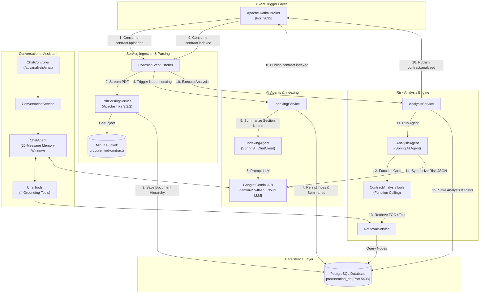

# ProcureMind — AI Service (`ai-service`)

The **AI Service** is the intelligence engine of the **ProcureMind** microservices ecosystem. Operating on port `8082`, it leverages **Spring Boot 4.0.7**, **Spring AI 1.1.0**, **Apache Tika 3.2.2**, **MinIO**, **PostgreSQL**, and cloud LLM inference via **Google Gemini API (Gemini 2.5 Flash)** to transform unstructured contract PDFs into hierarchical index trees, structured metadata, multi-factor risk assessments, and interactive conversational intelligence.

---

## 1. Purpose & Architectural Role

`ai-service` encapsulates all artificial intelligence, natural language document processing, agentic tool execution, and analytical query handling. It does not handle raw HTTP file uploads; instead, it is triggered asynchronously via Apache Kafka events, streaming documents directly from MinIO object storage.



---

## 2. Structure

```
ai-service/
├── pom.xml                                   # Maven build configuration & Spring AI dependencies
├── README.md                                 # Module documentation
└── src/
    ├── main/
    │   ├── java/com/procuremind/ai_service/
    │   │   ├── AiServiceApplication.java      # Spring Boot application entry point
    │   │   ├── agent/
    │   │   │   ├── AnalysisAgent.java         # Tool-calling risk assessment agent
    │   │   │   ├── ChatAgent.java             # Conversational agent with ChatMemory
    │   │   │   ├── IndexingAgent.java         # Document section indexing agent
    │   │   │   └── tools/
    │   │   │       ├── ChatTools.java         # Function calling tools for chat assistant
    │   │   │       └── ContractAnalysisTools.java # Function calling tools for risk agent
    │   │   ├── config/
    │   │   │   └── MinioConfig.java           # MinIO client configuration bean
    │   │   ├── controller/
    │   │   │   ├── AnalysisController.java    # CQRS analytics, TOC, metrics & comparison endpoints
    │   │   │   └── ChatController.java        # Conversational assistant REST endpoint
    │   │   ├── dto/
    │   │   │   ├── AnalysisResponseDto.java   # External risk analysis representation
    │   │   │   ├── ChatDtos.java              # Chat request, response, citation & search criteria
    │   │   │   ├── ClauseContentDto.java      # Clause text and title representation
    │   │   │   ├── ContractAnalysisResultDto.java # LLM structured JSON response schema
    │   │   │   ├── DashboardDtos.java         # KPI metrics, exposure, & distribution records
    │   │   │   ├── NodeSummary.java           # Section title and summary record
    │   │   │   └── TocNodeDto.java            # Table of Contents tree node
    │   │   ├── entity/
    │   │   │   ├── AnalysisRisk.java          # JPA entity for flagged clause risks
    │   │   │   ├── ContractAnalysis.java      # JPA entity for overall contract risk score
    │   │   │   ├── ContractMetadata.java      # JPA entity for contract type and amount
    │   │   │   ├── NodeType.java              # Enum: ROOT, ARTICLE, SECTION
    │   │   │   └── PageIndexNode.java         # JPA entity for document tree node
    │   │   ├── Repository/
    │   │   │   ├── AnalysisRiskRepository.java
    │   │   │   ├── ContractAnalysisRepository.java
    │   │   │   ├── ContractMetadataRepository.java
    │   │   │   └── PageIndexNodeRepository.java
    │   │   └── service/
    │   │       ├── AnalysisQueryService.java  # Read-only CQRS query aggregator
    │   │       ├── AnalysisService.java       # Analysis orchestration & persistence
    │   │       ├── ConversationService.java   # Chat orchestrator and response wrapper
    │   │       ├── IndexingService.java       # Node summarization batch orchestrator
    │   │       ├── PdfParsingService.java     # Apache Tika PDF extraction & regex parsing
    │   │       ├── RetrievalService.java      # Data access layer for agent tools
    │   │       └── kafka/
    │   │           ├── ContractEventListener.java # Kafka message listener
    │   │           └── ContractEventProducer.java # Kafka event publisher
    │   └── resources/
    │       ├── application.yaml               # Service configuration & LLM options
    │       ├── db/migration/
    │       │   └── V1__init_schema.sql        # Flyway initial schema definition
    │       └── prompts/
    │           ├── chat-assistant.st          # Prompt template for conversational agent
    │           └── contract-analysis.st       # Prompt template for risk analysis agent
    └── test/
        └── java/com/procuremind/ai_service/
            └── AiServiceApplicationTests.java
```

---

## 3. How It Works

### Execution Flow: Input ➔ Processing ➔ Output

```
1. [Input]: Kafka event "contract.uploaded" received with contractId and MinIO object key.
2. [Parsing]: PdfParsingService streams the PDF from MinIO, extracts raw text via Apache Tika, and splits content into a hierarchical tree (ROOT, ARTICLE, SECTION) using regex pattern matching.
3. [Indexing]: IndexingService iterates over unindexed nodes; IndexingAgent calls Ollama (Qwen2.5 7B) to generate concise titles and summaries, then publishes "contract.indexed".
4. [Analysis]: AnalysisService triggers AnalysisAgent which uses Spring AI Function Calling (ContractAnalysisTools) to inspect the Table of Contents, reads specific high-risk clauses, and synthesizes a risk score (1-10) and identified risks, then publishes "contract.analyzed".
5. [Conversation]: When users interact with the chat assistant, ChatController routes the request through ConversationService and ChatAgent, utilizing ChatTools to query pre-computed analyses and raw clauses.
6. [Output]: REST API endpoints serve CQRS read models to the UI.
```

---

## 4. Key Classes & Components

### 1. `PdfParsingService` (`service/PdfParsingService.java`)
- Streams PDF documents directly from the MinIO `procuremind-contracts` bucket.
- Uses `org.apache.tika.Tika` with unlimited string length to extract character streams.
- Identifies structure using regex patterns:
  - `ARTICLE_PATTERN`: Matches `ARTICLE I`, `ARTICLE 1 - Term`, etc.
  - `SECTION_PATTERN`: Matches numbered sections (`1.1`, `2.3.1`).
  - `NOISE_PATTERN`: Filters out standalone page numbers (`page 1 of 12`).
- Builds a connected tree of `PageIndexNode` entities with hierarchy levels (`ROOT` = Level 1, `ARTICLE` = Level 2, `SECTION` = Level 3+).

### 2. `IndexingAgent` (`agent/IndexingAgent.java`)
- Prompts Ollama with the system prompt:
  > *"You are an expert legal document indexing assistant. Extract title (3-5 words) and summary (1-2 sentences)..."*
- Uses Spring AI `ChatClient.entity(NodeSummary.class)` to bind the LLM response into an immutable Java record.

### 3. `AnalysisAgent` (`agent/AnalysisAgent.java`)
- Uses Spring AI Function Calling with `ContractAnalysisTools` to perform multi-step grounded analysis.
- Prompt: `src/main/resources/prompts/contract-analysis.st`.
- Converts the final LLM response into `ContractAnalysisResultDto` via `BeanOutputConverter`.

### 4. `ContractAnalysisTools` (`agent/tools/ContractAnalysisTools.java`)
- `@Tool getContractSummary(documentId)`: Fetches Table of Contents (Node IDs, titles, summaries) to locate relevant clauses.
- `@Tool getClauseContent(nodeId)`: Fetches exact raw text for a specific clause node.

### 5. `ChatAgent` (`agent/ChatAgent.java`) & `ChatTools` (`agent/tools/ChatTools.java`)
- Memory-backed conversational agent using `MessageWindowChatMemory` (retains last 20 messages per session).
- Prompt: `src/main/resources/prompts/chat-assistant.st`.
- Equipped with four tools:
  - `discoverContracts`: Discovers contracts matching metadata criteria.
  - `getCachedAnalysis`: Returns pre-computed risk score and identified risks instantly.
  - `getContractSummary`: Retrieves the semantic Table of Contents.
  - `getClauseContent`: Fetches exact legal text for deep evidence retrieval.

### 6. `RetrievalService` (`service/RetrievalService.java`)
- Backing service that implements the database lookups and formatting for all agent tools.

### 7. `AnalysisQueryService` (`service/AnalysisQueryService.java`)
- Read-only CQRS query service computing dashboard KPI metrics, risk distributions, financial exposure scatter points, contract type distributions, and contract comparisons.

---

## 5. Dependencies & Integrations

- **Internal**:
  - `com.procuremind:procuremind-common`: Shared event DTOs (`ContractUploadedEvent`, `PageIndexedEvent`).
- **External Frameworks**:
  - **Spring Boot 4.0.7**: Core application framework.
  - **Spring AI 1.1.0**: ChatClient, function calling annotations (`@Tool`), and output converters.
  - **Apache Tika 3.2.2**: Text extraction engine for PDF binaries.
  - **Spring Data JPA & Hibernate**: Relational persistence.
  - **Flyway**: Database schema migration.
  - **MinIO Java SDK 8.5.17**: Object storage client.
  - **Spring Kafka**: Event messaging.
  - **Ollama**: Local LLM inference server running `qwen2.5:7b`.

---

## 6. Database Schema (`procuremind_db`)

The schema is initialized via Flyway script `src/main/resources/db/migration/V1__init_schema.sql`:

```sql
-- Hierarchical Document Sections
CREATE TABLE page_index_nodes (
    id             UUID NOT NULL PRIMARY KEY,
    document_id    UUID,
    parent_node_id UUID,
    level          INTEGER,
    node_order     INTEGER,
    node_type      VARCHAR(255),
    title          TEXT,
    summary        TEXT,
    raw_context    TEXT
);

-- Contract Analysis Results
CREATE TABLE contract_analysis (
    id             UUID NOT NULL PRIMARY KEY,
    contract_id    UUID NOT NULL UNIQUE,
    risk_score     DOUBLE PRECISION,
    recommendation VARCHAR(255),
    status         VARCHAR(255),
    created_at     TIMESTAMP WITHOUT TIME ZONE
);

-- Contract Extracted Metadata
CREATE TABLE contract_metadata (
    id            UUID NOT NULL PRIMARY KEY,
    contract_id   UUID NOT NULL UNIQUE,
    contract_type VARCHAR(255),
    amount        DOUBLE PRECISION
);

-- Individual Clause Risks
CREATE TABLE analysis_risks (
    id          UUID NOT NULL PRIMARY KEY,
    analysis_id UUID REFERENCES contract_analysis(id),
    severity    VARCHAR(255),
    description TEXT
);
```

---

## 7. REST API Specification

Base Path: `/api/analysis` (Routed through API Gateway at port `8080` or direct at port `8082`).

| HTTP Method | Endpoint | Description | Query / Body Parameters |
| :--- | :--- | :--- | :--- |
| `POST` | `/api/analysis/chat` | Interactive agentic chat query | `ChatRequestDto` (`userMessage`, `conversationId`) |
| `GET` | `/api/analysis/{contractId}` | Fetch risk score, recommendation, and metadata | Path variable `contractId` (UUID) |
| `GET` | `/api/analysis/{contractId}/risks` | Fetch identified clause risks for a contract | Path variable `contractId` (UUID) |
| `GET` | `/api/analysis/{contractId}/toc` | Retrieve Table of Contents tree nodes | Path variable `contractId` (UUID) |
| `GET` | `/api/analysis/node/{nodeId}` | Retrieve raw clause text and title | Path variable `nodeId` (UUID) |
| `GET` | `/api/analysis/dashboard-metrics` | Retrieve global KPIs (total, high risk, avg score) | None |
| `GET` | `/api/analysis/risks/top` | Retrieve top 5 most frequent risky clauses | None |
| `GET` | `/api/analysis/financial-exposure` | Retrieve financial exposure vs risk points | None |
| `GET` | `/api/analysis/risks/distribution` | Retrieve risk severity count distribution | None |
| `GET` | `/api/analysis/contracts/type-distribution` | Retrieve contract type distribution | None |
| `GET` | `/api/analysis/compare` | Compare risk scores across contracts | `?ids=uuid1,uuid2` |

---

## 8. Kafka Events

| Event Topic | Direction | Payload Class | Trigger / Description |
| :--- | :--- | :--- | :--- |
| `contract.uploaded` | Consumed | `ContractUploadedEvent` | Triggers PDF download, Tika parsing, and IndexingAgent execution. |
| `contract.indexed` | Produced | `PageIndexedEvent` (`status="INDEXED"`) | Published after all section nodes are summarized. |
| `contract.indexed` | Consumed | `PageIndexedEvent` | Triggers AnalysisAgent to execute risk assessment. |
| `contract.analyzed` | Produced | `PageIndexedEvent` (`status="ANALYSIS_COMPLETED"`) | Published when risk assessment and metadata persistence finish. |

---

## 9. Configuration (`application.yaml`)

```yaml
server:
  port: 8082

spring:
  datasource:
    url: jdbc:postgresql://localhost:5433/procuremind_db
    username: user
    password: password
  jpa:
    hibernate:
      ddl-auto: validate
  kafka:
    bootstrap-servers: localhost:9092
    consumer:
      group-id: ai-processing-group
    properties:
      spring.json.trusted.packages: "com.procuremind.*"
  ai:
    ollama:
      base-url: http://localhost:11434
      chat:
        options:
          model: qwen2.5:7b
          temperature: 0.0
          num-ctx: 8192
```

---

## 10. How to Run

### Prerequisites
1. Ensure Ollama is running and model is downloaded:
   ```bash
   docker exec -it procuremind-ollama ollama pull qwen2.5:7b
   ```
2. Ensure infrastructure containers (PostgreSQL, MinIO, Kafka) are active.
3. Install `procuremind-common` library:
   ```bash
   cd ../procuremind-common
   ./mvnw clean install -DskipTests
   cd ../ai-service
   ```

### Running Locally
```bash
./mvnw spring-boot:run
```

### OpenAPI / Swagger UI
Navigate to `http://localhost:8082/swagger-ui.html` when running.

---

## 11. Troubleshooting

1. **`AnalysisAgent` empty response / JSON parsing error**:
   - Verify that Ollama is accessible at `http://localhost:11434` and `qwen2.5:7b` is pulled.
   - Verify that MinIO has the PDF file and `page_index_nodes` were generated during the indexing phase.
2. **Kafka Deserialization errors**:
   - Ensure `spring.json.trusted.packages` is set to `"com.procuremind.*"` in `application.yaml`.
3. **Database connection failure**:
   - If running locally outside Docker, ensure PostgreSQL port is mapped to `5433` (as configured in `docker-compose.yaml`).
