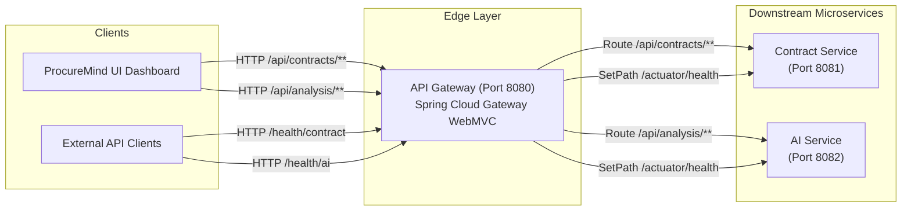

# ProcureMind — API Gateway Service (`api-gateway`)

The **API Gateway** is the single entry-point reverse proxy for the **ProcureMind** microservices ecosystem. Powered by **Spring Boot 4.0.7** and **Spring Cloud Gateway WebMVC** on **Java 21**, it centralizes incoming client HTTP request routing, path rewriting, and downstream service health probes.

---

## 1. Purpose & Architectural Role

In the ProcureMind microservices topology, the API Gateway resides at the edge layer, exposing port `8080`. It decouples client applications (such as `procuremind-ui`) from downstream internal service network topologies, allowing services to scale or relocate without impacting API consumers.



---

## 2. Structure

```
api-gateway/
├── pom.xml                                   # Maven build configuration & Spring Cloud dependencies
├── README.md                                 # Module documentation
└── src/
    ├── main/
    │   ├── java/com/procuremind/api_gateway/
    │   │   └── ApiGatewayApplication.java    # Spring Boot application entry point
    │   └── resources/
    │       └── application.yaml              # Declarative routes, predicates, and filters
    └── test/
        └── java/com/procuremind/api_gateway/
            └── ApiGatewayApplicationTests.java
```

---

## 3. How It Works

### Execution Flow: Request ➔ Predicate Matching ➔ Route Forwarding

```
1. [Inbound Request]: Client sends HTTP request to http://localhost:8080.
2. [Route Evaluation]: Spring Cloud Gateway WebMVC matches path predicates defined in application.yaml.
3. [Filter Execution]: For health check routes (/health/contract, /health/ai), the SetPath filter rewrites the path to /actuator/health.
4. [Forwarding]: Request is proxied to the configured downstream target URL (CONTRACT_SERVICE_URL or AI_SERVICE_URL).
5. [Response]: Returns downstream response directly to the client with identical HTTP status and headers.
```

---

## 4. Key Classes & Components

### 1. `ApiGatewayApplication` (`src/main/java/com/procuremind/api_gateway/ApiGatewayApplication.java`)
- Application bootstrap class annotated with `@SpringBootApplication`.

### 2. `application.yaml` (`src/main/resources/application.yaml`)
- Declarative configuration declaring all route definitions, predicates, filter actions, actuator exposures, and logging levels.

---

## 5. Gateway Route Configuration

```yaml
spring:
  cloud:
    gateway:
      server:
        webmvc:
          routes:
            - id: contract-service-route
              uri: ${CONTRACT_SERVICE_URL:http://localhost:8081}
              predicates:
                - Path=/api/contracts, /api/contracts/**

            - id: ai-service-route
              uri: ${AI_SERVICE_URL:http://localhost:8082}
              predicates:
                - Path=/api/analysis, /api/analysis/**

            - id: contract-service-health
              uri: ${CONTRACT_SERVICE_URL:http://localhost:8081}
              predicates:
                - Path=/health/contract
              filters:
                - SetPath=/actuator/health

            - id: ai-service-health
              uri: ${AI_SERVICE_URL:http://localhost:8082}
              predicates:
                - Path=/health/ai
              filters:
                - SetPath=/actuator/health
```

### Route Summary Table

| Route ID | Inbound Path Predicate | Filter Action | Target Downstream Service | Default Fallback URL |
| :--- | :--- | :--- | :--- | :--- |
| `contract-service-route` | `/api/contracts`, `/api/contracts/**` | None (Direct proxy) | Contract Service | `http://localhost:8081` |
| `ai-service-route` | `/api/analysis`, `/api/analysis/**` | None (Direct proxy) | AI Service | `http://localhost:8082` |
| `contract-service-health` | `/health/contract` | `SetPath=/actuator/health` | Contract Service Actuator | `http://localhost:8081/actuator/health` |
| `ai-service-health` | `/health/ai` | `SetPath=/actuator/health` | AI Service Actuator | `http://localhost:8082/actuator/health` |

---

## 6. Environment Variables

| Variable Name | Default Value | Description |
| :--- | :--- | :--- |
| `SERVER_PORT` | `8080` | HTTP port on which the API Gateway listens. |
| `CONTRACT_SERVICE_URL` | `http://localhost:8081` | Base URL for downstream `contract-service` instances. |
| `AI_SERVICE_URL` | `http://localhost:8082` | Base URL for downstream `ai-service` instances. |

---

## 7. Observability & Health Probes

The gateway exposes its own health probes and proxies downstream service health:

* **Gateway Health**: `GET http://localhost:8080/actuator/health`
* **Proxied Contract Service Health**: `GET http://localhost:8080/health/contract`
* **Proxied AI Service Health**: `GET http://localhost:8080/health/ai`

---

## 8. How to Run

### Prerequisites
- Java 21 JDK installed.
- Downstream services running (`contract-service` on port 8081, `ai-service` on port 8082).

### Running Locally
```bash
./mvnw spring-boot:run
```

### Running with Custom Target URLs
```bash
CONTRACT_SERVICE_URL=http://localhost:8081 AI_SERVICE_URL=http://localhost:8082 ./mvnw spring-boot:run
```

---

## 9. Troubleshooting

1. **`503 Service Unavailable` or `502 Bad Gateway`**:
   - Verify downstream microservices are running on ports 8081 (`contract-service`) and 8082 (`ai-service`).
   - Check target URL environment variables `CONTRACT_SERVICE_URL` and `AI_SERVICE_URL`.
2. **Health endpoint returns 404**:
   - Ensure downstream services have Spring Boot Actuator enabled on `/actuator/health`.
