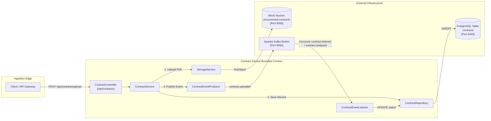

# ProcureMind — Contract Service (`contract-service`)

The **Contract Service** owns the **Contract Ingestion and Lifecycle Bounded Context** in the **ProcureMind** microservices ecosystem. Operating on port `8081`, it handles HTTP multipart contract PDF uploads, streams physical files to **MinIO Object Storage**, persists metadata in **PostgreSQL**, emits domain lifecycle events to **Apache Kafka**, and synchronizes contract processing status asynchronously.

---

## 1. Purpose & Architectural Role

`contract-service` serves as the authoritative system of record for contract metadata and physical document storage. It isolates file ingestion concerns from downstream AI analysis pipelines.



---

## 2. Structure

```
contract-service/
├── pom.xml                                   # Maven build configuration & dependencies
├── README.md                                 # Module documentation
└── src/
    ├── main/
    │   ├── java/com/procuremind/contract_service/
    │   │   ├── ContractServiceApplication.java# Spring Boot application entry point
    │   │   ├── config/
    │   │   │   └── MinioConfig.java           # MinIO client connection configuration
    │   │   ├── controller/
    │   │   │   └── ContractController.java    # REST endpoints for contract upload & status
    │   │   ├── dto/
    │   │   │   └── ContractResponseDto.java   # Contract metadata response DTO
    │   │   ├── entity/
    │   │   │   └── Contract.java              # JPA entity mapped to table 'contracts'
    │   │   ├── repository/
    │   │   │   └── ContractRepository.java    # Spring Data JPA repository
    │   │   └── service/
    │   │       ├── ContractService.java       # Contract lifecycle coordinator
    │   │       ├── StorageService.java        # MinIO bucket creation & upload handler
    │   │       └── kafka/
    │   │           ├── ContractEventListener.java # Kafka consumer for indexed/analyzed events
    │   │           └── ContractEventProducer.java # Kafka publisher for contract.uploaded
    │   └── resources/
    │       └── application.yaml               # Database, Kafka, and MinIO configuration
    └── test/
        └── java/com/procuremind/contract_service/
            └── ContractServiceApplicationTests.java
```

---

## 3. How It Works

### Execution Flow: Input ➔ Processing ➔ Output

```
1. [Input]: Client submits multipart/form-data containing PDF file and optional vendorName to POST /api/contracts/upload.
2. [Storage]: StorageService verifies existence of the "procuremind-contracts" bucket in MinIO (auto-creating if missing) and streams the binary content with a UUID prefix.
3. [Persistence]: ContractService persists a new Contract entity in PostgreSQL with initial status "UPLOADED".
4. [Event Emission]: ContractEventProducer publishes ContractUploadedEvent to Kafka topic "contract.uploaded".
5. [Response]: Returns HTTP 202 Accepted with ContractResponseDto immediately to prevent blocking the client.
6. [State Synchronization]: When downstream AI processing completes stages, ContractEventListener consumes "contract.indexed" (updating status to "INDEXED") and "contract.analyzed" (updating status to "ANALYZED").
```

---

## 4. Key Classes & Components

### 1. `ContractController` (`controller/ContractController.java`)
- Exposes REST endpoints under `/api/contracts`.
- Handles multipart uploads with `@RequestPart("file")` and `@RequestParam("vendorName")`.

### 2. `ContractService` (`service/ContractService.java`)
- Coordinates file storage, database transactions (`@Transactional`), and Kafka event publishing.
- Methods:
  - `processNewContract(file, vendorName)`: Ingests file, persists record, emits event.
  - `getAllContracts()`: Lists all contracts in the repository.
  - `getContractDetails(contractId)`: Returns single contract metadata.
  - `getContractStatus(contractId)`: Returns current status map (`{"status": "ANALYZED"}`).

### 3. `StorageService` (`service/StorageService.java`)
- Encapsulates interaction with `io.minio.MinioClient`.
- Automatically ensures the `procuremind-contracts` bucket exists.
- Streams files to MinIO without loading entire files into memory buffers.

### 4. `ContractEventProducer` (`service/kafka/ContractEventProducer.java`)
- Sends `ContractUploadedEvent` payloads to Kafka topic `contract.uploaded`.

### 5. `ContractEventListener` (`service/kafka/ContractEventListener.java`)
- Listens to Kafka topics `contract.indexed` and `contract.analyzed` using group ID `contract-processing-group`.
- Updates contract status to `INDEXED` or `ANALYZED` upon receiving notification events.

---

## 5. Dependencies & Integrations

- **Internal**:
  - `com.procuremind:procuremind-common`: Shared event DTOs (`ContractUploadedEvent`, `PageIndexedEvent`).
- **External Dependencies**:
  - **Spring Boot 4.0.7**: Web MVC, Actuator, and Transaction management.
  - **Spring Data JPA & PostgreSQL Driver**: Data persistence.
  - **MinIO Java SDK 8.5.17**: Object storage client.
  - **Spring Kafka**: Message broker producer and listener.
  - **SpringDoc OpenAPI 3.0**: Interactive Swagger API documentation.

---

## 6. Database Entity & Schema

Target Database: PostgreSQL (`procuremind_db`)  
Table Name: `contracts`

```sql
CREATE TABLE contracts (
    id                UUID NOT NULL PRIMARY KEY,
    filename          VARCHAR(255) NOT NULL,
    minio_object_name VARCHAR(255) NOT NULL,
    vendor_name       VARCHAR(255),
    status            VARCHAR(50) NOT NULL,
    uploaded_at       TIMESTAMP WITHOUT TIME ZONE NOT NULL
);
```

---

## 7. REST API Specification

Base Path: `/api/contracts` (Routed through API Gateway at port `8080` or direct at port `8081`).

| HTTP Method | Endpoint | Description | Request Format | Response Status |
| :--- | :--- | :--- | :--- | :--- |
| `POST` | `/api/contracts/upload` | Upload new contract PDF | `multipart/form-data` (`file`, `vendorName`) | `202 Accepted` |
| `GET` | `/api/contracts` | List all uploaded contracts | None | `200 OK` |
| `GET` | `/api/contracts/{id}` | Get contract details by ID | Path variable `id` (UUID) | `200 OK` / `404 Not Found` |
| `GET` | `/api/contracts/{id}/status` | Check processing status | Path variable `id` (UUID) | `200 OK` / `404 Not Found` |

### Sample Upload Response Body (`ContractResponseDto`)
```json
{
  "id": "c0a80123-8c76-4d2b-9e12-3a4b5c6d7e8f",
  "fileName": "Master_Services_Agreement.pdf",
  "vendorName": "Acme Corp",
  "status": "UPLOADED",
  "uploadedAt": "2026-08-20T19:30:00"
}
```

---

## 8. Kafka Events

| Event Topic | Direction | Payload Class | Trigger / Action |
| :--- | :--- | :--- | :--- |
| `contract.uploaded` | Produced | `ContractUploadedEvent` | Triggered when contract is uploaded and saved to MinIO. |
| `contract.indexed` | Consumed | `PageIndexedEvent` | Updates contract entity status to `INDEXED`. |
| `contract.analyzed` | Consumed | `PageIndexedEvent` | Updates contract entity status to `ANALYZED`. |

---

## 9. Configuration (`application.yaml`)

```yaml
server:
  port: 8081

spring:
  servlet:
    multipart:
      enabled: true
      max-file-size: 70MB
      max-request-size: 70MB
  datasource:
    url: jdbc:postgresql://localhost:5433/procuremind_db
    username: user
    password: password
  jpa:
    hibernate:
      ddl-auto: validate
  kafka:
    bootstrap-servers: localhost:9092
    consumer:
      group-id: contract-processing-group
    properties:
      spring.json.trusted.packages: "com.procuremind.*"
```

---

## 10. How to Run

### Prerequisites
1. Ensure PostgreSQL, MinIO, and Kafka containers are active via `docker-compose up -d`.
2. Install `procuremind-common` library:
   ```bash
   cd ../procuremind-common
   ./mvnw clean install -DskipTests
   cd ../contract-service
   ```

### Running Locally
```bash
./mvnw spring-boot:run
```

### OpenAPI / Swagger UI
Navigate to `http://localhost:8081/swagger-ui.html` when running.

---

## 11. Troubleshooting

1. **Upload fails with `MaxUploadSizeExceededException`**:
   - Ensure the uploaded PDF is within the 70MB limit defined in `spring.servlet.multipart.max-file-size`.
2. **MinIO Connection Refused**:
   - If running locally outside Docker, ensure `MinioConfig` points to `http://localhost:9000` (or `http://minio:9000` when inside Docker network).
3. **Kafka event not received**:
   - Verify Kafka is reachable at `localhost:9092` and Kafka UI at `http://localhost:8085` displays topic `contract.uploaded`.
