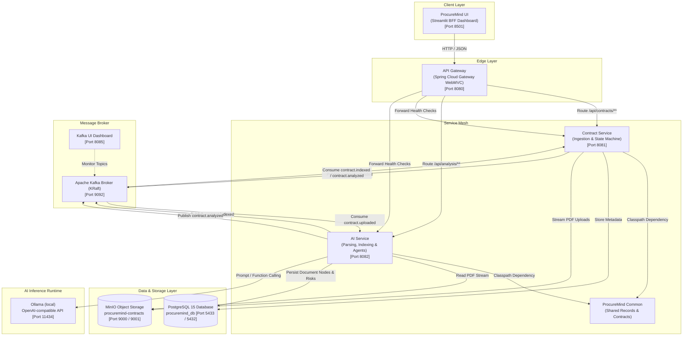
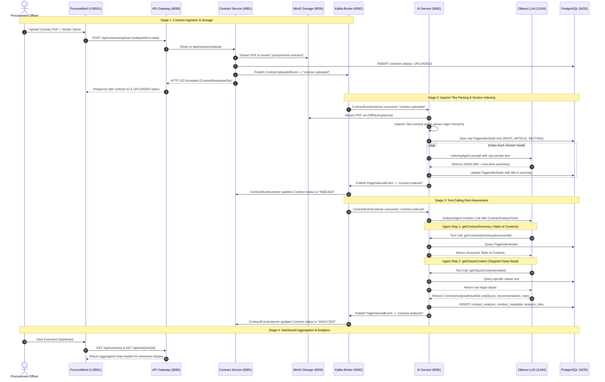
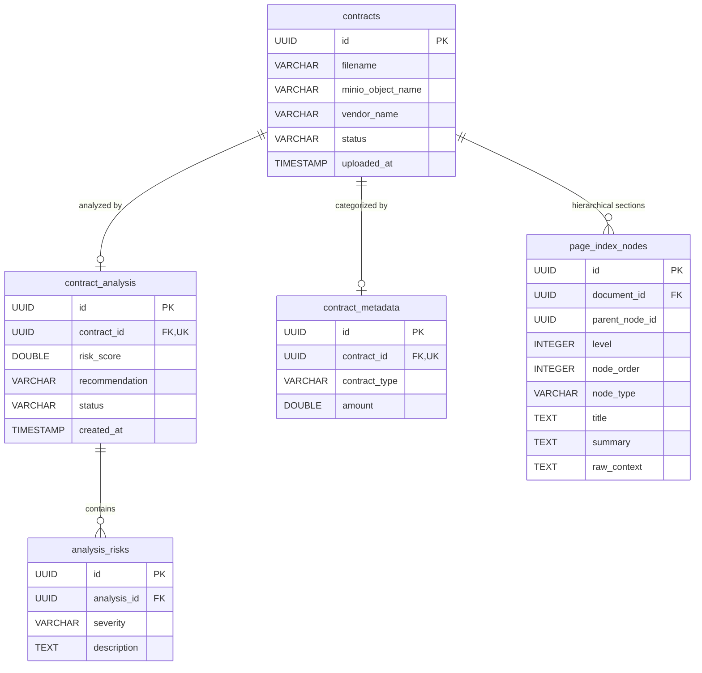
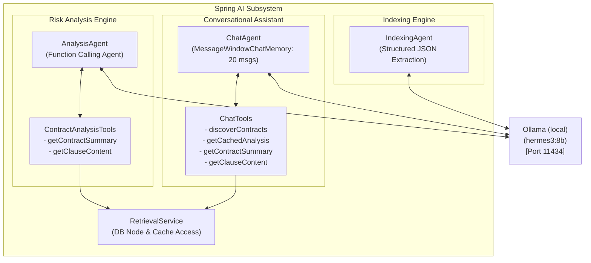

# ProcureMind — System Architecture Specification

This document serves as the comprehensive architectural specification for **ProcureMind**, an enterprise AI-native procurement contract analysis and risk intelligence platform.

---

## 1. System Overview & Architectural Paradigm

ProcureMind automates the ingestion, hierarchical structure-aware indexing, compliance tracking, and risk scoring of corporate legal contracts (e.g., Master Services Agreements, Statements of Work, NDAs, Terms & Conditions).

The platform is designed around four core architectural principles:
1. **Domain-Driven Design (DDD)**: Strict isolation between contract lifecycle management and AI compute pipelines.
2. **Event-Driven Choreography**: Non-blocking asynchronous message passing powered by Apache Kafka (KRaft).
3. **Agentic AI with Deterministic Tool Calling**: LLM reasoning guided by Spring AI Function Calling to minimize token consumption and eliminate hallucinations.
4. **Command-Query Responsibility Segregation (CQRS) / BFF**: Fast, responsive executive dashboards merging contract operational data with AI risk insights.



---

## 2. End-to-End Execution Sequence

The contract processing pipeline flows through three distinct stages: **Ingestion**, **Hierarchical Indexing**, and **Multi-Factor Risk Analysis**.



---

## 3. Bounded Contexts & Domain Architecture

ProcureMind strictly separates business domains into two primary microservices and one shared contract module:

```
ProcureMind/
├── procuremind-common/     # Immutable Event Contracts & Shared DTOs
├── contract-service/       # Contract Lifecycle & Object Storage Bounded Context
├── ai-service/             # Document Intelligence & Agentic AI Bounded Context
├── api-gateway/            # Edge Routing & Health Reverse Proxy
└── procuremind-ui/         # Streamlit BFF Executive Interface
```

### Domain Isolation Rules
1. **Contract Ingestion Isolation**: `contract-service` manages physical files, contract metadata, and upload timestamps. It has **zero AI dependencies** and never performs LLM operations.
2. **AI & Parsing Isolation**: `ai-service` receives asynchronous event triggers containing object keys, streams files directly from MinIO, and persists analysis results. It exposes analytical read APIs and has **zero direct dependency on `contract-service` code**.
3. **Shared Contracts**: Microservices communicate schemas solely through `procuremind-common` Java records.

---

## 4. Asynchronous Event Topology (Kafka)

All cross-service state transitions are orchestrated via Apache Kafka topics using KRaft consensus:

| Kafka Topic | Producer Service | Consumer Service(s) | Payload DTO | Consumer Group | Trigger / Description |
| :--- | :--- | :--- | :--- | :--- | :--- |
| `contract.uploaded` | `contract-service` | `ai-service` | `ContractUploadedEvent` | `ai-processing-group` | Emitted when a PDF file is saved to MinIO. Triggers Apache Tika parsing and node indexing. |
| `contract.indexed` | `ai-service` | `contract-service`, `ai-service` | `PageIndexedEvent` | `contract-processing-group`, `ai-processing-group` | Emitted when all section nodes have titles and summaries. Triggers `contract-service` status update and `ai-service` risk analysis. |
| `contract.analyzed` | `ai-service` | `contract-service` | `PageIndexedEvent` | `contract-processing-group` | Emitted when `AnalysisAgent` completes risk scoring. Updates contract status to `ANALYZED`. |

### Event Schema Specifications

#### `ContractUploadedEvent` (`com.procuremind.common.dto`)
```java
public record ContractUploadedEvent(
    UUID contractId,
    String filename,
    String minioObjName
) {}
```

#### `PageIndexedEvent` (`com.procuremind.common.dto`)
```java
public record PageIndexedEvent(
    UUID contractId,
    String status
) {}
```

---

## 5. Storage & Database Schema Architecture

ProcureMind utilizes PostgreSQL (`procuremind_db`) managed via Flyway migrations (`V1__init_schema.sql`) and MinIO Object Storage (`procuremind-contracts` bucket).



### Table Definitions & Roles

1. **`contracts`**: Managed by `contract-service`. Tracks uploaded documents, MinIO storage keys, vendor names, and lifecycle states (`UPLOADED`, `INDEXED`, `ANALYZED`).
2. **`page_index_nodes`**: Managed by `ai-service`. Stores the parsed document hierarchy:
   - `level 1`: `ROOT` (Document root).
   - `level 2`: `ARTICLE` (Major article/clause heading).
   - `level 3+`: `SECTION` (Numbered sub-clauses, e.g., `2.1`, `3.4.1`).
   - `raw_context`: Exact legal text parsed from the PDF.
   - `title` & `summary`: AI-generated summaries of the section text.
3. **`contract_analysis`**: Managed by `ai-service`. Stores overall risk score (1.0 to 10.0), executive recommendation, and processing status.
4. **`contract_metadata`**: Extracted contract categorization (e.g., `MSA`, `SOW`, `NDA`) and total monetary commitment amount ($).
5. **`analysis_risks`**: Individual flagged risk entries with severity levels (`HIGH`, `MEDIUM`, `LOW`) and descriptions.

---

## 6. AI Subsystem & Agent Architecture

The AI intelligence subsystem in `ai-service` is built on **Spring AI 1.1.0** and communicates with a **local Ollama server** (`hermes3:8b` by default) via Spring AI's OpenAI-compatible model starter with temperature `0.0`.



### 1. `IndexingAgent`
- **Purpose**: Iterates over unindexed `PageIndexNode` entries and extracts a concise title (3-5 words) and executive summary (1-2 sentences).
- **Mechanism**: Utilizes Spring AI `ChatClient.entity(NodeSummary.class)` to enforce strict JSON output without markdown fences.

### 2. `AnalysisAgent`
- **Purpose**: Acts as a Senior Enterprise Procurement Officer evaluating financial, operational, and legal liability risks.
- **Workflow**:
  1. Calls `getContractSummary(documentId)` to inspect the Table of Contents.
  2. Calls `getClauseContent(nodeId)` for high-risk clauses (Liability, Indemnification, Termination, Insurance, Governing Law).
  3. Synthesizes findings into `ContractAnalysisResultDto` with an overall score (1.0 to 10.0), recommendation, and granular risk list.
- **Prompt**: `src/main/resources/prompts/contract-analysis.st`
- **Context Efficiency**: Inspecting the Table of Contents before retrieving full clause text reduces token context usage by up to 80% compared to dumping entire contracts into the prompt.

### 3. `ChatAgent`
- **Purpose**: Interactive conversational assistant for procurement officers to query contracts, compare terms, and investigate risk flags.
- **Mechanism**: Configured with `MessageWindowChatMemory` (maintaining 20 conversational turns per `conversationId`) and four deterministic tools:
  - `discoverContracts`: Filters contracts by vendor, document type, minimum risk score.
  - `getCachedAnalysis`: Returns pre-computed risk score and risk list instantly without LLM re-computation.
  - `getContractSummary`: Fetches the hierarchical Table of Contents.
  - `getClauseContent`: Fetches the exact legal clause text for deep reading.
- **Prompt**: `src/main/resources/prompts/chat-assistant.st`

---

### 6.1 Retrieval model — structure-aware, not vector-based

There is no vector store, no embedding model and no similarity search anywhere in this
system, and none is planned. Earlier wording in this repository described the retrieval
layer as "Vectorless RAG" or "Agentic Vector RAG"; both were misleading and have been
replaced by **hierarchical, structure-aware retrieval**.

What actually happens is:

1. `PdfParsingService` turns the extracted text into a tree of `page_index_nodes` using the
   document's own numbering (`ARTICLE ...` at level 2, dotted `1.2.3` sections deeper).
2. `IndexingService` gives every node an LLM-written title and one- or two-sentence summary.
3. `RetrievalService` exposes two deterministic JPA lookups to the model as tools:
   `getContractSummary(documentId)` returns the whole table of contents, and
   `getClauseContent(nodeId)` returns one node's raw text.
4. The model reads the table of contents, chooses the node identifiers it needs, and asks
   for exactly those clauses.

Selection is therefore done by the model over an explicit structure, not by cosine
similarity over an opaque index. For contracts this is a real advantage rather than a
shortcut: retrieval is exact and auditable (a citation is a node id, not a chunk offset),
clause boundaries are respected rather than cut at an arbitrary token count, and there is no
index to rebuild or keep in sync. The cost is that the whole table of contents goes into the
prompt, so the approach is bounded by context window rather than by corpus size. A vector
index would only become necessary for cross-contract search over a corpus too large to
enumerate, which is not a use case this system has.

## 7. Edge Gateway & Network Routing

The **API Gateway** (`api-gateway`) is a Spring Cloud Gateway WebMVC reverse proxy exposing port `8080`.

### Route Mapping Specification

| Inbound Path Predicate | Target Service | Forwarded URL | Filter / Modification | Purpose |
| :--- | :--- | :--- | :--- | :--- |
| `/api/contracts`, `/api/contracts/**` | `contract-service` | `http://contract-service:8081` | Direct Proxy | Contract upload, list, status, and details |
| `/api/analysis`, `/api/analysis/**` | `ai-service` | `http://ai-service:8082` | Direct Proxy | Risk analysis, TOC, metrics, chat, comparisons |
| `/health/contract` | `contract-service` | `http://contract-service:8081` | `SetPath=/actuator/health` | Proxied Actuator health probe |
| `/health/ai` | `ai-service` | `http://ai-service:8082` | `SetPath=/actuator/health` | Proxied Actuator health probe |
| `/actuator/health` | `api-gateway` | Local Actuator | Local Handler | Gateway's own health status |

---

## 8. Failure Handling & Idempotency Guarantees

1. **Duplicate Event Handling**: `AnalysisService.processContract` verifies `analysisRepository.existsByContractId(contractId)` before initiating LLM analysis. Duplicate Kafka events do not trigger redundant AI inference.
2. **MinIO Auto-Provisioning**: `StorageService` verifies bucket existence and provisions `procuremind-contracts` on startup if absent.
3. **Resilient Parsing**: `PdfParsingService` cleans noise headers and page numbers using regex matching, handling non-standard PDF formats cleanly.
4. **Database Migration Safety**: Schema tables and unique constraints (`uc_contract_analysis_contractid`, `uc_contract_metadata_contractid`) are managed via version-controlled Flyway scripts (`V1__init_schema.sql`).
5. **Resumable Indexing**: `IndexingService` commits each node's summary as it is produced and works under a wall-clock budget (`app.indexing.max-duration`). A timeout or redelivery resumes from the nodes that still have a null summary instead of restarting the contract, and the budget keeps the consumer thread inside the broker's `max.poll.interval.ms`.
6. **Retry and Dead-Lettering**: Listeners propagate exceptions rather than swallowing them, so `KafkaErrorHandlingConfig`'s `DefaultErrorHandler` applies three attempts with a five-second backoff and then routes the record to `<topic>.DLT`. The same recoverer publishes `contract.failed`, which moves the contract to `FAILED` so a stuck document is visible rather than pinned at `UPLOADED` forever.
7. **Monotonic Status**: `ContractEventListener.shouldAdvance` only ever moves a contract forward through `UPLOADED -> INDEXED -> ANALYZED`, and treats `FAILED` as terminal. A redelivered `contract.indexed` cannot drag an already-analysed contract backwards.
8. **After-Commit Publishing**: Both `ContractEventProducer`s defer the Kafka send to `afterCommit` when a transaction is active, and log the send future's outcome. A rolled-back write therefore publishes nothing, and a failed publish is no longer silent.

### 8.1 Known gap: no transactional outbox

After-commit publishing closes one direction of the dual write (an event for a row that was
never committed) but not the other. If the database commits and the broker is then
unreachable, the event is lost: the contract stays at `UPLOADED` or `INDEXED` and nothing
retries, because the failure happens after the listener has already returned.

Closing that gap properly means a **transactional outbox**: each producer writes the event
into an `outbox_events` table inside the same transaction as the state change, and a
separate relay (a scheduled poller, or Debezium reading the write-ahead log) publishes rows
from that table to Kafka and marks them sent. Consumers already tolerate duplicates through
their `existsBy...` guards and the monotonic status rule, so at-least-once relay delivery is
safe here.

This is deliberately **not implemented yet**. It adds a table, a migration, a relay
component and its own failure modes to two services, and the current exposure is narrow: a
single-broker local deployment where a post-commit broker outage is both rare and
recoverable by replaying the upload. It is recorded here as the next reliability item rather
than half-built. The producer classes point at this section so the gap stays visible at the
code that causes it.
